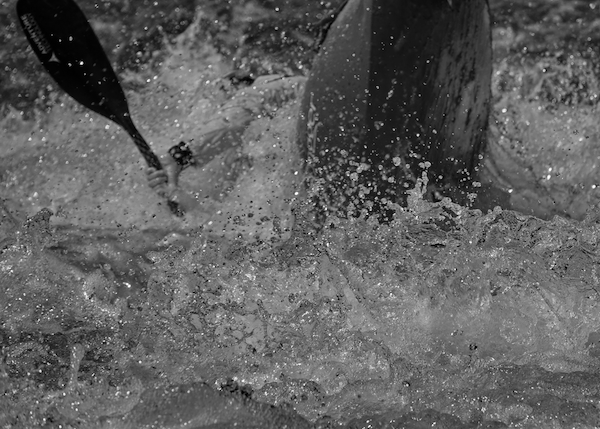

# [CISC 4080: Algorithms](http://www.dsm.fordham.edu/~eschomburg/algorithms/)
## Homework 6 (check back for updates)
#### Due Wednesday, November 22</h4
        
1.  The following files contain an implementation, and some testing
    code, of a binary heap for use as a min-priority queue. You
    must complete the implementation of the class in the header
    file (`bin_heap.h`), which you will use in follow-up
    questions. If you compile the `bin_heap.cpp` file
    run the resulting executable, it will allow you to test the
    heap by manually entering new elements (as value and key pairs)
    and observing the resulting heap as it repeatedly pops its min-
    key values.

    * [`bin_heap.h`](bin_heap.h)
    * [`bin_heap.cpp`](bin_heap.cpp)

1.  The following files contain C++ code and a text file with
    interstate highway route distances between cities across the
    United States. Use the priority queue (heap) you built in
    the previous part to implement Dijkstra's algorithm for finding
    the shortest routes between cities.

    The `Graph` class defined in `graph.h` is
    very similar to that found in HW5, but slightly modified to
    incorporate edges with non-integer lengths. You should not need
    to modify it. Your task is to complete the implementations of
    the `Dijkstra()` and `get_path()`
    functions in `routes.cpp` to obtain the path distances
    sought in the `test_shortest_paths()` function that 
    runs when the compiled code is executed from the command line.

    The `test_shortest_paths()` function should print
    paths and path distances between:
    i. New York to Los Angeles
    i. New York to Miami
    i. New York to Seattle
    i. New York to San Francisco
    i. New York to Bostong

    As in any problem you are trying to solve, it may help in your
    code development to create a smaller graph for testing purposes.
    Feel free to do that in this case on your own, creating a smaller
    city graph file from the one provided and having the program use
    your modified version until you have your program working.

    * [`graph.h`](graph.h)
    * [`routes.cpp`](routes.cpp)
    * [`city_connections.txt`](city_connections.txt)

1.  **DESCRIPTION AND FILES TO BE UPDATED...**
    Once again use your binary heap min-prority queue, this to
    compress the image displayed below. The left image uses 8-bit
    grayscale (i.e., 256 luminance levels) and is 429x600 pixels.
    The right image has the same dimensions, but uses only 4 bits
    per pixel. However, it can be further compressed by using
    Huffman encoding.

     | 

    Complete/answer the following tasks/questions:
    i.  Complete the code in [`huffman.cpp`](huffman.cpp) to
        reduce/compress the image data. This file uses classes and
        functions defined in [`huffman.h`](huffman.h) and
        [`image.h`](image.h), which you probably want to look at for
        reference, but should not need to modify. Download the code
        and image files below. Note that the image file is not
        actually encoded in a standard image file format, it is
        instead a text file containing a 429x600 matrix of pixel
        brightnesses (grayscale levels) for you to work with in C++
        without having to install additional tools on your computer.
        * [`huffman.cpp`](huffman.cpp)
        * [`huffman.h`](huffman.h)
        * [`image.h`](image.h)
        * [`kayak_mat.dat`](kayak_mat.dat)

    i.  Why is does the compression factor typically improve as
        the number of grayscale levels are reduced? But why is
        it worse for 8 levels compared to 9 levels?

1.  ** *Extra credit:* **
    **DESCRIPTION AND FILES TO BE UPDATED...**

If you are running Windows and do not already know how to compile and execute C++
programs on your machine, these instructions should be helpful:
https://cs.calvin.edu/courses/cs/112/resources/installingEclipse/cygwin/.

You should utilize resources online, such as http://www.cplusplus.com/reference/
if you aren't familiar with some of the C++ classes and data structures
used here.

Email your code, answers, and the path distance matrix output file to
me () by midnight on the due date,
and please email me for questions and clarifications before then.
